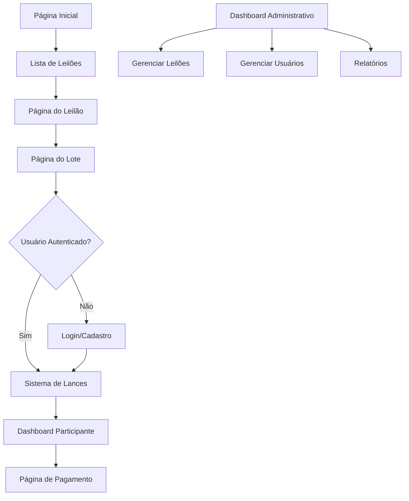

## 1. Visão Geral do Produto

O Leiloapp é uma plataforma de leilões online desenvolvida para a Santa Casa de União de Minas, permitindo a realização de leilões beneficentes de forma digital e acessível. O sistema conecta doadores, compradores e a instituição em um ambiente seguro e transparente, maximizando o potencial de arrecadação para as causas da instituição.

O produto resolve o problema da limitação geográfica e logística dos leilões presenciais, permitindo que pessoas de qualquer lugar participem dos leilões beneficentes. A plataforma ajuda a instituição a aumentar seu alcance, melhorar a gestão dos leilões e proporcionar uma experiência moderna e conveniente aos participantes.

## 2. Funcionalidades Principais

### 2.1 Papéis de Usuário

| Papel | Método de Registro | Permissões Principais |
|------|---------------------|------------------|
| Visitante | Não requer registro | Visualizar leilões ativos e histórico |
| Participante | Cadastro com CPF e dados pessoais | Fazer lances, acompanhar leilões, gerenciar perfil |
| Administrador | Cadastro interno pela instituição | Criar/editar leilões, gerenciar lotes, aprovar usuários, visualizar relatórios |

### 2.2 Módulos de Funcionalidades

O Leiloapp consiste nas seguintes páginas principais:

1. **Página Inicial**: Apresentação da instituição, leilões em destaque, navegação principal
2. **Página de Leilões**: Lista de leilões ativos, filtros por categoria, busca
3. **Página do Leilão**: Detalhes do leilão, lista de lotes, cronômetro, estatísticas
4. **Página do Lote**: Imagens do item, descrição detalhada, histórico de lances, formulário de lance
5. **Página de Login/Cadastro**: Formulários de autenticação e registro de novos usuários
6. **Dashboard do Participante**: Meus lances, leilões vencidos, histórico de participações
7. **Dashboard Administrativo**: Criar/editar leilões, gerenciar lotes, aprovar usuários, relatórios
8. **Página de Pagamento**: Informações de pagamento para lotes arrematados

### 2.3 Detalhes das Páginas

| Nome da Página | Módulo | Descrição das Funcionalidades |
|-----------|-------------|---------------------|
| Página Inicial | Hero Section | Apresentação visual da Santa Casa com imagens institucionais e mensagem de impacto |
| Página Inicial | Leilões em Destaque | Carrossel com 3-5 leilões mais relevantes ou urgentes |
| Página Inicial | Estatísticas | Exibir total arrecadado, número de participantes e leilões realizados |
| Página de Leilões | Lista de Leilões | Grid responsivo com cards de leilões ativos, mostrando imagem, título, tempo restante e lance atual |
| Página de Leilões | Filtros e Busca | Filtros por categoria, faixa de preço, data; campo de busca por palavra-chave |
| Página do Leilão | Informações Principais | Título, descrição, data/hora de início e término, cronômetro em tempo real |
| Página do Leilão | Lista de Lotes | Tabela ou grid com todos os lotes, mostrando imagem, título, lance atual e número de lances |
| Página do Lote | Galeria de Imagens | Carrossel de imagens do item com zoom e visualização em tela cheia |
| Página do Lote | Detalhes do Item | Descrição completa, especificações técnicas, condição, valor estimado |
| Página do Lote | Sistema de Lances | Formulário para inserir valor do lance, botão de confirmar, validação de valor mínimo |
| Página do Lote | Histórico de Lances | Lista em tempo real com todos os lances, valores, horários e nomes dos participantes |
| Login/Cadastro | Autenticação | Formulário com CPF, senha, validação de campos obrigatórios |
| Login/Cadastro | Registro | Formulário completo com dados pessoais, endereço, telefone, termos de uso |
| Dashboard Participante | Meus Lances | Tabela com lances ativos, valores, status e tempo restante |
| Dashboard Participante | Leilões Vencidos | Histórico de participações com resultados e valores |
| Dashboard Administrativo | Gerenciar Leilões | CRUD completo de leilões com formulários de criação e edição |
| Dashboard Administrativo | Aprovar Usuários | Lista de usuários pendentes com botões de aprovação/rejeição |
| Página de Pagamento | Informações de Pagamento | Exibir valor total, opções de pagamento (boleto, cartão, PIX), prazo para pagamento |

## 3. Fluxo Principal do Processo

### Fluxo do Participante
1. Usário acessa a página inicial e visualiza leilões disponíveis
2. Navega para página de leilões específicos ou lista geral
3. Seleciona um leilão e visualiza seus lotes
4. Escolhe um lote específico para ver detalhes
5. Realiza cadastro/login se ainda não estiver autenticado
6. Insere valor do lance e confirma participação
7. Acompanha em tempo real se foi superado
8. Se vencer, recebe notificação e acesso à página de pagamento
9. Realiza pagamento dentro do prazo estabelecido

### Fluxo do Administrador
1. Acessa dashboard administrativo com login especial
2. Cria novo leilão com informações básicas e define lotes
3. Gerencia usuários pendentes de aprovação
4. Monitora andamento dos leilões em tempo real
5. Visualiza relatórios de arrecadação e participação
6. Encerra leilões e gera relatórios finais

## 4. Design da Interface do Usuário

### 4.1 Estilo de Design
- **Cores Primárias**: Azul institucional (#1e3a8a) e branco, transmitindo confiança e seriedade
- **Cores Secundárias**: Verde (#10b981) para sucesso e vermelho (#ef4444) para alertas
- **Estilo de Botões**: Arredondados com sombras sutis, hover effects suaves
- **Tipografia**: Fonte sans-serif moderna (Inter ou Roboto), títulos em 24-32px, texto corporal em 16px
- **Layout**: Card-based com grid responsivo, navegação superior fixa
- **Ícones**: Estilo outline minimalista, consistente em todo o sistema

### 4.2 Visão Geral das Páginas

| Página | Módulo | Elementos de UI |
|-----------|-------------|-------------|
| Página Inicial | Hero Section | Imagem de fundo com overlay azul, texto branco, botão CTA destacado |
| Página Inicial | Cards de Leilões | Cards com borda arredondada, sombra, imagem 16:9, badge de tempo restante |
| Página do Lote | Galeria | Thumbnails horizontais, imagem principal grande, botão de zoom |
| Página do Lote | Formulário de Lance | Input numérico grande e destacado, botão verde prominente |
| Dashboard | Tabelas | Tabelas zebra-striped, ações em botões ícone, paginação |

### 4.3 Responsividade
- **Mobile-first**: Design otimizado para smartphones (360px+)
- **Breakpoints**: 768px (tablet), 1024px (desktop), 1440px (wide)
- **Touch optimization**: Botões com área mínima de 44x44px, gestos de swipe para galerias
- **Performance**: Imagens otimizadas com lazy loading, CSS/JS minificado