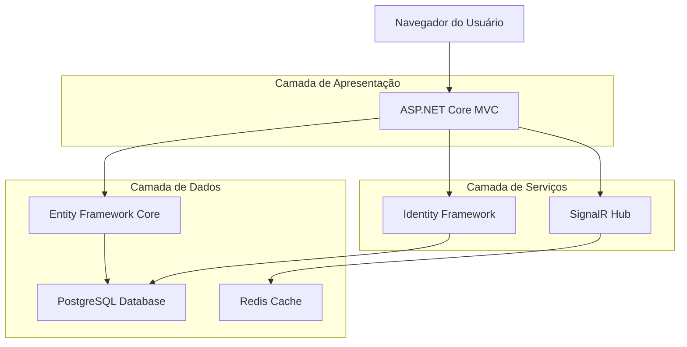
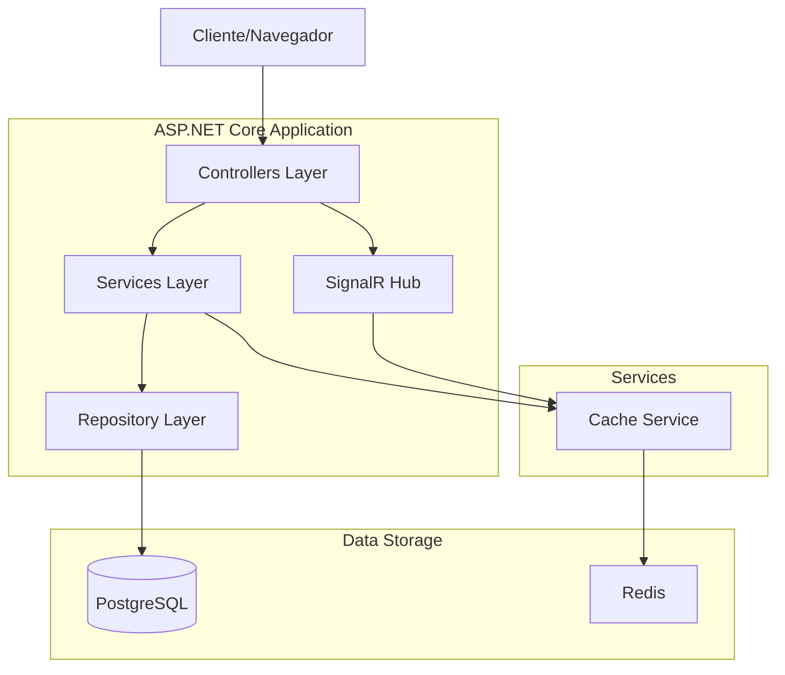
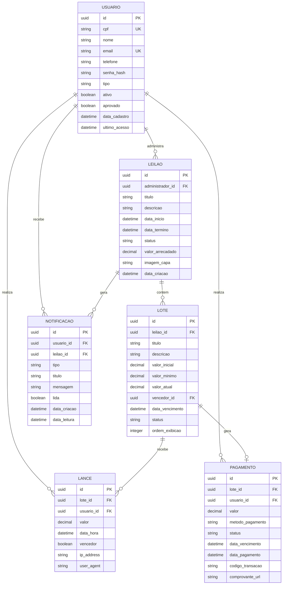

## 1. Arquitetura do Sistema



## 2. Descrição das Tecnologias

- **Frontend**: ASP.NET Core MVC 7.0 + Bootstrap 5 + jQuery + SignalR Client
- **Backend**: ASP.NET Core Web API 7.0
- **Banco de Dados**: PostgreSQL 14+
- **ORM**: Entity Framework Core 7.0
- **Cache**: Redis 6+ (para sessões SignalR e cache de lances)
- **Autenticação**: ASP.NET Core Identity
- **Validação**: FluentValidation
- **Logging**: Serilog
- **Testes**: xUnit + Moq

## 3. Definições de Rotas

| Rota | Finalidade |
|-------|---------|
| / | Página inicial com leilões em destaque |
| /leiloes | Lista de todos os leilões ativos |
| /leilao/{id} | Detalhes de um leilão específico |
| /lote/{id} | Página do lote com sistema de lances |
| /auth/login | Página de login do usuário |
| /auth/register | Página de cadastro de novos usuários |
| /dashboard | Dashboard do participante/administrador |
| /pagamento/{loteId} | Página de pagamento para lotes vencidos |
| /api/lances | API REST para operações de lances |
| /api/leiloes | API REST para gerenciamento de leilões |
| /hubs/leilao | Hub SignalR para comunicação em tempo real |

## 4. Especificações de API

### 4.1 API de Autenticação

```http
POST /api/auth/login
```

Request:
```json
{
  "cpf": "123.456.789-00",
  "senha": "senha123",
  "lembrarMe": true
}
```

Response:
```json
{
  "sucesso": true,
  "token": "eyJhbGciOiJIUzI1NiIsInR5cCI6IkpXVCJ9...",
  "usuario": {
    "id": "guid",
    "nome": "João Silva",
    "email": "joao@email.com",
    "tipo": "Participante"
  }
}
```

### 4.2 API de Lances

```http
POST /api/lances/realizar
```

Request:
```json
{
  "loteId": "guid",
  "valor": 1500.00,
  "leilaoId": "guid"
}
```

Response:
```json
{
  "sucesso": true,
  "lanceId": "guid",
  "mensagem": "Lance realizado com sucesso",
  "novoValorAtual": 1500.00
}
```

```http
GET /api/lances/historico/{loteId}
```

Response:
```json
{
  "lotes": [
    {
      "id": "guid",
      "valor": 1500.00,
      "dataHora": "2024-01-15T14:30:00",
      "participante": {
        "id": "guid",
        "nome": "Maria Santos",
        "avatar": "/images/avatar.jpg"
      }
    }
  ]
}
```

### 4.3 API de Leilões

```http
GET /api/leiloes/ativos
```

Response:
```json
{
  "leiloes": [
    {
      "id": "guid",
      "titulo": "Leilão de Arte Beneficente",
      "descricao": "Leilão com obras de arte para arrecadação de fundos",
      "dataInicio": "2024-01-20T10:00:00",
      "dataTermino": "2024-01-25T18:00:00",
      "totalLotes": 45,
      "valorArrecadado": 125000.00,
      "imagemCapa": "/images/leilao1.jpg",
      "status": "Aberto"
    }
  ]
}
```

## 5. Arquitetura do Servidor



## 6. Modelo de Dados

### 6.1 Diagrama Entidade-Relacionamento



### 6.2 Definições de Tabelas (DDL)

```sql
-- Tabela de Usuários
CREATE TABLE usuarios (
    id UUID PRIMARY KEY DEFAULT gen_random_uuid(),
    cpf VARCHAR(14) UNIQUE NOT NULL,
    nome VARCHAR(255) NOT NULL,
    email VARCHAR(255) UNIQUE NOT NULL,
    telefone VARCHAR(20),
    senha_hash VARCHAR(255) NOT NULL,
    tipo VARCHAR(20) NOT NULL CHECK (tipo IN ('Participante', 'Administrador')),
    ativo BOOLEAN DEFAULT true,
    aprovado BOOLEAN DEFAULT false,
    data_cadastro TIMESTAMP WITH TIME ZONE DEFAULT NOW(),
    ultimo_acesso TIMESTAMP WITH TIME ZONE,
    CONSTRAINT chk_cpf_format CHECK (cpf ~ '^\d{3}\.\d{3}\.\d{3}-\d{2}$')
);

-- Índices para usuários
CREATE INDEX idx_usuarios_cpf ON usuarios(cpf);
CREATE INDEX idx_usuarios_email ON usuarios(email);
CREATE INDEX idx_usuarios_tipo ON usuarios(tipo);
CREATE INDEX idx_usuarios_aprovado ON usuarios(aprovado);

-- Tabela de Leilões
CREATE TABLE leiloes (
    id UUID PRIMARY KEY DEFAULT gen_random_uuid(),
    administrador_id UUID NOT NULL REFERENCES usuarios(id),
    titulo VARCHAR(255) NOT NULL,
    descricao TEXT,
    data_inicio TIMESTAMP WITH TIME ZONE NOT NULL,
    data_termino TIMESTAMP WITH TIME ZONE NOT NULL,
    status VARCHAR(20) NOT NULL DEFAULT 'Aberto' CHECK (status IN ('Aberto', 'EmAndamento', 'Finalizado', 'Cancelado')),
    valor_arrecadado DECIMAL(15,2) DEFAULT 0,
    imagem_capa VARCHAR(500),
    data_criacao TIMESTAMP WITH TIME ZONE DEFAULT NOW(),
    CONSTRAINT chk_datas CHECK (data_termino > data_inicio)
);

-- Índices para leilões
CREATE INDEX idx_leiloes_status ON leiloes(status);
CREATE INDEX idx_leiloes_data_inicio ON leiloes(data_inicio);
CREATE INDEX idx_leiloes_data_termino ON leiloes(data_termino);

-- Tabela de Lotes
CREATE TABLE lotes (
    id UUID PRIMARY KEY DEFAULT gen_random_uuid(),
    leilao_id UUID NOT NULL REFERENCES leiloes(id),
    titulo VARCHAR(255) NOT NULL,
    descricao TEXT,
    valor_inicial DECIMAL(15,2) NOT NULL,
    valor_minimo DECIMAL(15,2) NOT NULL,
    valor_atual DECIMAL(15,2) DEFAULT 0,
    vencedor_id UUID REFERENCES usuarios(id),
    data_vencimento TIMESTAMP WITH TIME ZONE,
    status VARCHAR(20) NOT NULL DEFAULT 'Aberto' CHECK (status IN ('Aberto', 'EmLicitacao', 'Vendido', 'NaoVendido')),
    ordem_exibicao INTEGER DEFAULT 0,
    data_criacao TIMESTAMP WITH TIME ZONE DEFAULT NOW(),
    CONSTRAINT chk_valores CHECK (valor_minimo >= valor_inicial)
);

-- Índices para lotes
CREATE INDEX idx_lotes_leilao_id ON lotes(leilao_id);
CREATE INDEX idx_lotes_status ON lotes(status);
CREATE INDEX idx_lotes_vencedor_id ON lotes(vencedor_id);

-- Tabela de Lances
CREATE TABLE lances (
    id UUID PRIMARY KEY DEFAULT gen_random_uuid(),
    lote_id UUID NOT NULL REFERENCES lotes(id),
    usuario_id UUID NOT NULL REFERENCES usuarios(id),
    valor DECIMAL(15,2) NOT NULL,
    data_hora TIMESTAMP WITH TIME ZONE DEFAULT NOW(),
    vencedor BOOLEAN DEFAULT false,
    ip_address INET,
    user_agent TEXT,
    CONSTRAINT chk_valor_positivo CHECK (valor > 0)
);

-- Índices para lances
CREATE INDEX idx_lances_lote_id ON lances(lote_id);
CREATE INDEX idx_lances_usuario_id ON lances(usuario_id);
CREATE INDEX idx_lances_data_hora ON lances(data_hora DESC);
CREATE INDEX idx_lances_vencedor ON lances(vencedor);

-- Tabela de Imagens dos Lotes
CREATE TABLE lote_imagens (
    id UUID PRIMARY KEY DEFAULT gen_random_uuid(),
    lote_id UUID NOT NULL REFERENCES lotes(id),
    url_imagem VARCHAR(500) NOT NULL,
    titulo VARCHAR(255),
    ordem INTEGER DEFAULT 0,
    principal BOOLEAN DEFAULT false,
    data_upload TIMESTAMP WITH TIME ZONE DEFAULT NOW()
);

CREATE INDEX idx_lote_imagens_lote_id ON lote_imagens(lote_id);
CREATE INDEX idx_lote_imagens_principal ON lote_imagens(principal);
```

## 7. Design de Comunicação em Tempo Real

### 7.1 Hub SignalR Configuration

```csharp
public class LeilaoHub : Hub
{
    public async Task EntrarLeilao(string leilaoId)
    {
        await Groups.AddToGroupAsync(Context.ConnectionId, $"leilao-{leilaoId}");
        await Clients.Group($"leilao-{leilaoId}").SendAsync("UsuarioEntrou", Context.User.Identity.Name);
    }
    
    public async Task SairLeilao(string leilaoId)
    {
        await Groups.RemoveFromGroupAsync(Context.ConnectionId, $"leilao-{leilaoId}");
        await Clients.Group($"leilao-{leilaoId}").SendAsync("UsuarioSaiu", Context.User.Identity.Name);
    }
    
    public async Task EnviarLance(string leilaoId, string loteId, decimal valor)
    {
        await Clients.Group($"leilao-{leilaoId}")
            .SendAsync("NovoLance", new { loteId, valor, usuario = Context.User.Identity.Name, timestamp = DateTime.UtcNow });
    }
    
    public async Task EntrarLote(string loteId)
    {
        await Groups.AddToGroupAsync(Context.ConnectionId, $"lote-{loteId}");
    }
    
    public async Task SairLote(string loteId)
    {
        await Groups.RemoveFromGroupAsync(Context.ConnectionId, $"lote-{loteId}");
    }
}
```

### 7.2 Eventos de Tempo Real

- **Novo Lance**: Broadcast para todos os usuários visualizando o lote
- **Lance Superado**: Notificação ao usuário que foi superado
- **Tempo Restante**: Atualização do cronômetro a cada segundo
- **Status do Leilão**: Mudanças de status (aberto, em andamento, finalizado)
- **Notificações**: Alertas personalizados para cada usuário

## 8. Design de Segurança e Autenticação

### 8.1 Configuração de Autenticação

```csharp
services.AddIdentity<Usuario, IdentityRole>(options =>
{
    options.Password.RequireDigit = true;
    options.Password.RequiredLength = 8;
    options.Password.RequireNonAlphanumeric = false;
    options.Password.RequireUppercase = true;
    options.Password.RequireLowercase = true;
    
    options.Lockout.DefaultLockoutTimeSpan = TimeSpan.FromMinutes(15);
    options.Lockout.MaxFailedAccessAttempts = 5;
    options.Lockout.AllowedForNewUsers = true;
    
    options.User.RequireUniqueEmail = true;
    options.User.AllowedUserNameCharacters = "abcdefghijklmnopqrstuvwxyzABCDEFGHIJKLMNOPQRSTUVWXYZ0123456789-._@+";
})
.AddEntityFrameworkStores<ApplicationDbContext>()
.AddDefaultTokenProviders();
```

### 8.2 Autorização por Papéis

```csharp
[Authorize(Roles = "Administrador")]
public class AdminController : Controller
{
    // Ações administrativas
}

[Authorize(Roles = "Participante,Administrador")]
public class LanceController : Controller
{
    [HttpPost]
    public async Task<IActionResult> RealizarLance([FromBody] LanceDto lance)
    {
        // Verificar se usuário está aprovado
        // Validar valor mínimo
        // Verificar tempo do leilão
        // Processar lance
    }
}
```

### 8.3 Validações de Segurança

- **Anti-Forgery Tokens**: Em todos os formulários POST
- **Rate Limiting**: Limitar número de lances por minuto
- **Validação de Dados**: Server-side validation com FluentValidation
- **CORS**: Configurado apenas para domínios autorizados
- **HTTPS**: Redirecionamento automático e HSTS
- **SQL Injection**: Protegido via Entity Framework Core parametrização
- **XSS**: Encoding automático do Razor + validação de entrada

## 9. Considerações de Performance e Escalabilidade

### 9.1 Estratégias de Cache

```csharp
// Cache distribuído com Redis
services.AddStackExchangeRedisCache(options =>
{
    options.Configuration = Configuration.GetConnectionString("Redis");
    options.InstanceName = "Leiloapp";
});

// Cache de resposta
[ResponseCache(Duration = 60, VaryByQueryKeys = new[] { "id" })]
public async Task<IActionResult> DetalhesLeilao(Guid id)
{
    // Retorna cache se disponível
}
```

### 9.2 Otimizações de Banco de Dados

- **Índices**: Criados em colunas frequentemente consultadas
- **Consultas Otimizadas**: Usar Include() para eager loading
- **Paginação**: Limite de 50 itens por página
- **Async/Await**: Todas as operações I/O assíncronas
- **Connection Pooling**: Configurado para 100 conexões máximas

### 9.3 Escalabilidade Horizontal

```yaml
# docker-compose.yml para escalar
version: '3.8'
services:
  web:
    image: leiloapp:latest
    deploy:
      replicas: 3
    environment:
      - Redis__ConnectionString=redis:6379
      - PostgreSQL__ConnectionString=Server=postgres;Database=leiloapp;
    depends_on:
      - redis
      - postgres
  
  redis:
    image: redis:6-alpine
    ports:
      - "6379:6379"
  
  postgres:
    image: postgres:14
    environment:
      POSTGRES_DB: leiloapp
      POSTGRES_USER: leiloapp
      POSTGRES_PASSWORD: senha123
```

### 9.4 Monitoramento e Logging

```csharp
// Configuração do Serilog
Log.Logger = new LoggerConfiguration()
    .MinimumLevel.Information()
    .WriteTo.Console()
    .WriteTo.File("logs/leiloapp-.txt", rollingInterval: RollingInterval.Day)
    .WriteTo.PostgreSQL(
        connectionString: Configuration.GetConnectionString("PostgreSQL"),
        tableName: "logs",
        schemaName: "public")
    .CreateLogger();

// Health Checks
services.AddHealthChecks()
    .AddDbContextCheck<ApplicationDbContext>()
    .AddRedis(Configuration.GetConnectionString("Redis"))
    .AddCheck<LeilaoServiceHealthCheck>("leilao_service");
```

## 10. Configuração de Deploy

### 10.1 Variáveis de Ambiente

```bash
# appsettings.Production.json
{
  "ConnectionStrings": {
    "PostgreSQL": "Server=${DB_HOST};Port=${DB_PORT};Database=${DB_NAME};User Id=${DB_USER};Password=${DB_PASSWORD};",
    "Redis": "${REDIS_CONNECTION}"
  },
  "Logging": {
    "LogLevel": {
      "Default": "Information",
      "Microsoft.AspNetCore": "Warning"
    }
  },
  "AllowedHosts": "*",
  "JwtSettings": {
    "Secret": "${JWT_SECRET}",
    "Issuer": "leiloapp.santacasaufm.com.br",
    "Audience": "leiloapp.santacasaufm.com.br",
    "ExpirationInMinutes": 60
  }
}
```

### 10.2 CI/CD Pipeline

```yaml
# .github/workflows/deploy.yml
name: Deploy to Production

on:
  push:
    branches: [ main ]

jobs:
  build-and-deploy:
    runs-on: ubuntu-latest
    
    steps:
    - uses: actions/checkout@v3
    
    - name: Setup .NET
      uses: actions/setup-dotnet@v3
      with:
        dotnet-version: '7.0.x'
    
    - name: Restore dependencies
      run: dotnet restore
    
    - name: Build
      run: dotnet build --no-restore --configuration Release
    
    - name: Test
      run: dotnet test --no-build --configuration Release --verbosity normal
    
    - name: Publish
      run: dotnet publish -c Release -o ./publish
    
    - name: Deploy to Server
      uses: appleboy/scp-action@master
      with:
        host: ${{ secrets.HOST }}
        username: ${{ secrets.USERNAME }}
        password: ${{ secrets.PASSWORD }}
        source: "./publish/*"
        target: "/var/www/leiloapp"